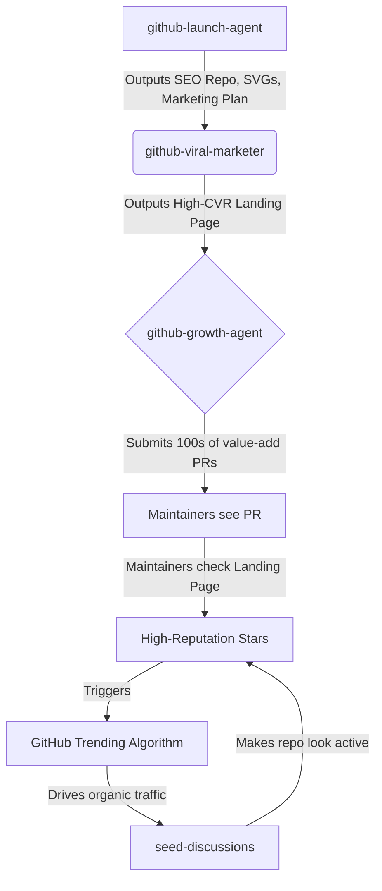

# Project Midas Architecture

The Midas Ecosystem isn't just a collection of disconnected tools. It is a **pipeline**. 
When these tools are chained together sequentially, they create a compounding flywheel of growth.

## The Growth Flywheel

### Phase 1: Creation (The Foundation)
You start with `github-launch-agent`. This tool is essentially an assembly line. It spawns 16 parallel agents that read your codebase, score 5 potential repository names for SEO, and automatically push a fully configured repo. 
*   **The Artifacts:** By the time this agent finishes, you have a beautiful SVG social preview embedded in your README, Issue Templates, and a 7-day marketing calendar.

### Phase 2: Conversion (The Landing Page)
A repository alone converts visitors to stargazers at a rate of ~2-5%. A repository backed by a premium, dark-mode landing page converts at 15-30%.
*   **The Tool:** You pass your newly created repo into `github-viral-marketer`. This tool strips your README and compiles it into a stunning, responsive, dark-mode web page deployed instantly to GitHub Pages.

### Phase 3: Traffic Generation (The Engine)
Now you have a high-converting landing page, but no traffic. This is where `github-growth-agent` takes over.
*   **The Mechanism:** You provide it a niche (e.g., "React components"). The agent searches GitHub, finds active repositories, and analyzes their `.github` folder. If they are missing a CI/CD workflow or Issue Templates, it forks the repo, injects the missing files, and submits a Pull Request.
*   **The Hook:** The PR description is highly polite and provides genuine value (saving the maintainer time). At the bottom of the PR, it says: *"Generated by [Your Project Name](link to your landing page)."*

### Phase 4: The Viral Loop
When the maintainers of those repositories review the PR, they will click your link. Because these are active maintainers, their GitHub accounts have high "Stargazer Reputation". 
*   When they star your repository, the GitHub Trending algorithm weighs their star heavily.
*   Within 24 hours of running the `github-growth-agent`, your Star Velocity spikes, pushing you onto the GitHub Trending page.
*   Once on the Trending page, organic traffic floods in, creating a self-sustaining loop.

---

## Future Integrations
The Midas architecture is designed to be extensible. Upcoming modules like `github-trend-oracle` will sit in front of the pipeline, automatically telling `github-growth-agent` exactly which repositories to target based on live Hacker News data.
