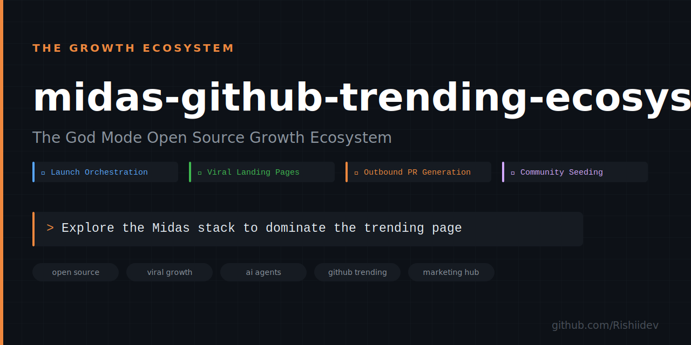

  
    
  <h1 align="center">Project Midas 📈</h1>
  

    <strong>The God Mode Open Source Growth Ecosystem</strong>
  

  

    A unified suite of AI Agents and CLI tools designed to engineer virality, dominate GitHub trending algorithms, and automate open-source growth. 
  

 

> **The Midas Philosophy:** Open-source virality is not about luck; it is about *Velocity*. GitHub's trending algorithm measures Star Velocity (stars within 24h) and Stargazer Reputation (who is starring). Project Midas is a heavily automated pipeline designed to systematically identify high-value targets, provide them genuine value, and funnel high-reputation stars back to your repositories. **Everything you touch turns to gold.**

---

## 🗂️ The Ecosystem

Project Midas is split into three distinct operational layers. You can run these tools independently or chain them together for maximum momentum.

### 1. The Launch Layer (Orchestration & Packaging)
These agents construct your repository from scratch, optimizing SEO, generating boilerplate, and preparing for extreme distribution.

| Tool | Platform | Description |
|---|---|---|
| **`github-launch-agent`** | Claude Code | The 16-agent parallel pipeline. Generates landing pages, SEO topics, SVGs, and 7-day marketing calendars in under 4 minutes. |
| **`claude-github-launch`** | Claude Code | The V1 specialized Claude launch skill for rapid deployment. |
| **`hermes-github-launch`** | Open Source / Hermes | A locally-run launch agent optimized for the Hermes model. |

### 2. The Growth Layer (Acquisition & Outbound)
Once your repo is launched, these tools drive the traffic. They automate the outbound process to acquire high-reputation stars.

| Tool | Platform | Description |
|---|---|---|
| **[`github-growth-agent`](https://github.com/Rishiidev/github-growth-agent)** | CLI / Node.js | The God Mode PR Engine. Automatically discovers repos in your niche, detects missing CI/CD or metadata, and submits polite PRs linking back to your project. |
| **`github-viral-marketer`** | CLI / Web | Generates stunning, high-converting, dark-mode landing pages for your open-source tools to maximize visitor-to-star conversion. |
| **`seed-discussions`** | CLI / Node.js | Automates the seeding of community discussions and issues to make your repo appear highly active to the GitHub algorithm. |

### 3. The Defense Layer (Auditing & Analytics)
Tools to analyze, maintain, and defend your viral momentum.

| Tool | Platform | Description |
|---|---|---|
| **`github-growth-check`** | CLI / Actions | Automated health checks for your repository SEO, conversion rate, and pipeline stability. |
| **`github-growth-kit`** | Docs | The bundled toolkit containing templates, SOPs, and advanced growth strategies. |

---

## 🚀 How to use the Midas Stack

To achieve "God Mode" virality, execute the stack in this order:

1. **Initialize**: Open Claude Code and type `/plugin install github:Rishiidev/github-launch-agent`. Run the launch agent to generate your repo, SEO assets, and marketing calendar.
2. **Convert**: Use the `github-viral-marketer` to instantly generate a stunning GitHub Pages landing site. A repo without a landing page bleeds traffic.
3. **Ignite**: Run the `github-growth-agent`. Set your target niche. The agent will find hundreds of repos, fix their missing CI workflows, and submit PRs. Maintainers will review the PR, click the link to your project in the description, and drop a star.
4. **Sustain**: Follow the 7-day marketing calendar generated in step 1 to hit Hacker News, Reddit, and Product Hunt.

Read the deep dive in [ARCHITECTURE.md](./ARCHITECTURE.md) to learn how the tools pass data between each other.

---

## 🤝 Contributing
Want to add a new tool to the Midas Ecosystem? 
- Open an issue for discussion.
- All tools must follow the "God Mode" dark-mode aesthetic and focus purely on algorithmic growth and virality.

## 📄 License
MIT License. Created by [Rishiidev](https://github.com/Rishiidev).
